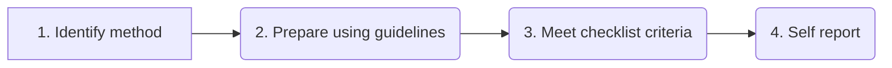

# Method Submission Guide
*Version 0.1*

**Taimoor Khan, Hajira Jabeen**

*This document serves as a guide for developing and submitting methods to the Methods Hub. It assists in method preparation through workflows, checklists, and guidelines to ensure conformance to the defined standards.*

**Abstract:**

The Methods Hub is an infrastructure project whose goal is to provide open and accessible computational methods to collect, access, and work with Digital Behavioral Data (DBD). The bulk of methods will stem from computer science, notably showcasing cutting-edge AI/ML techniques, alongside those originating from social sciences. It aims to serve as a pioneering platform designed to facilitate the propagation of computer science methodologies into social science research. 

*Note: This is a living document for content submission guidelines and therefore, the method submission scenarios, their definition and the checklist to adhere to are frozen for release 1 (June 2024). Additional changes in this regard will be considered for the next release.*

**Methods Hub Content Goal**

The Methods Hub content goal is to provide reusable, well-documented, and relevant content to social scientists that is appliable to Digital Behavioral Data.

**Methods Hub Content Objectives**

Methods Hub content has the following objectives. 
1. Enabling reuse of recent AI/ML models on Digital Behavioral Data in social science. 
2.	Empower social scientists in using AI methods. 
3.	Allows AI/ML method developers to reach a wider audience and contribute cross domain research challenges.

**Glossary**

| Term | Explanation | 
|----------|----------|
| Method    | Code snippets, one or more programming function , one or more programming classes or modularized software source code and its documentation.   |
| Tutorial    | A stepwise guide with or without code that explains working with an important tool, technology, or the available method(s). Tutorials facilitate and enable researchers to work with SOTA methods   |

**List of Abbreviations**

| Abbreviation | In full |   
|--------------|---------|
| DBD | Digital behavioral data |
| MH | Methods Hub |	
| CFF | [Citation File Format](https://citation-file-format.github.io/) |
| AI/ML | Artificial Intelligence/Machine Learning  |

## 1. Method Submission Workflow
The Methods Hub contains state-of-the-art AI/ML methods that can be applied to social science use cases and research questions. Only a fraction of these state-of-the-art methods is being used in the social science domain, however, there exists a vast array of untapped potential methods that could significantly provide benefits to the field. The method submission workflow guides to identify, develop and share existing advanced AI/ML methods specifically prepared for the social science community and offering them through Methods Hub as its niche platform. 

This document serves as a roadmap for navigating the method submission process. The method submission workflow is aimed to empower developers/researchers to identify recent and interesting methods, resolve submission constraints if any, and make methods and tutorials Methods Hub ready i.e., developers and researchers can shape their methods for the Methods Hub users following these guidelines. It also encourages existing methods that are relevant and of interest to social scientists to be offered through the Methods Hub platform. Alternate criteria are defined to facilitate such prominent methods while staying within scope of the Methods Hub. Figure 1 provides the method submission workflow where the methods fulfilling the Methods Hub guidelines ready to submit through the portal. The method submission workflow is followed by the method review workflow that ensures adherence to the provided standards; however, the review workflow is out of the scope of this document.

1. **Identify method:** Identify and develop a method that is in demand in social science.
2. **Prepare using guidelines:** Refer to the guidelines and templates to document the method for the target audience.
3. **Meet checklist criteria:** Ensure the method meets the Methods Hub scope criteria.
4. **Self-report:** Self-report the method for review by submitting throughthe Methods Hub portal

## 1.1. Methods Dimensions
Methods Hub portal stands on the principles of open science only facilitating content that is developed with open resources and is make publicly available with open license. The methods submitted are reviewed from three overlapping dimensions to ensure that they meet the requirements of the Methods Hub. They are:

1. Method relevance i.e., the method is applicable to social science use cases or research questions.
2. Recent AI/ML methods i.e., the method is at present state-of-the-art method in the computer science or social science community.
3. Method documentation quality i.e., the documentation quality is reviewed either by the Methods Hub team or is already reviewed by a trusted third party e.g., renowned software publishing venues to make sure that the method is well documented and require minimum effort to understand and reuse the method for new research questions and use cases.
   
The methods recently developed in the computer science community with AI/ML and NLP models are more often representing state-of-the-art research. However, they need to establish relevance for applicability of the method in social science. The guidelines assist in crafting the method README for this purpose. Whereas the methods developed in the social science community are known to be relevant to the social science community already, but they may not always be using state-of-the-art AI/ML models. The method review process ensures that the methods shared through the Methods Hub platform are representing state-of-the-art AI/ML methods and have established relevance with social science use cases.

## 1.2.	Trusted Third-party Review Bodies
There are journals and other software publishing venues that ensures the software is reusable and well-documented through a review process. Some of the trusted software publishing venues in computer science and social science venues are listed here ([prominent social science software publishing venues](supporting-documents/prominent-venues.md)). The list is expected to grow with newer venues identified and reported. These venues have well defined documentation requirements to make the code readable, understandable, and reusable. For example, [sweater: Speedy Word Embedding Association Test and Extras Using R](https://joss.theoj.org/papers/10.21105/joss.04036). The code is reviewed for its quality too; therefore, these methods already comply with the MH method submission requirements and can be submitted directly.

## 1.3.	Alternative for Established Methods
The prominent AI/ML methods that are applicable and of interest in the social science domain, having well established repositories with active communities can also be added to Methods Hub. As a bridge, Methods Hub expands the use of these methods to social science research community while offering the social science research community more methods to choose and modify for their research questions. Such established method repos e.g., [SANSA](https://sda.tech/author/hajirajabeen/) and [BERD-NFDI](https://github.com/BERD-NFDI/bear-ml/tree/main/bearml) are of value in the social science domain as well. To establish relevance for these methods, an alternative option is provided i.e., to write tutorials that demonstrate the use of these methods on a social science use case, as a stepwise easy to follow process. The [tutorial template](tutorial-template.md) provides a content structure for writing tutorials with marked mandatory sections and suggestions for optional sections.

*Note: Chapter 6 provides details of what to consider as a method and how to identify methods from research pipelines.*

The remaining document is structured as follows. Chapter 2 provides checklists for method submission. Chapters 3 discusses scope of the Methods Hub content. Chapter 4 provide guidelines on preparing a method for Methods Hub submission. Chapter 5 discusses the documentation and code quality guidelines for the methods. Chapter 6 assists to identify methods from previous, current, or future research work and how to modularize it for the Methods Hub. Chapter 7 lists additional resources in following the guidelines and preparing the methods for submission.

# 2. Methods Submission Checklist

The Methods checklist provides the minimum criteria that need to be met for the methods to be submitted to the Methods Hub. 

Method Name: ____________________________________

Method Developer & Email: ___________________________________

Method repo URL: ______________________________________

## 2.1. Checklists for Computer science and Social science methods submission
1.	Openness: Methods Hub Preconditions (Chapter3 in method guidelines)
   
|   | Openness criteria|
|---|------------------|
| ☐ | Open-sourced programming language |
| ☐ | Publicly accessible script |
| ☐ | Open license for reuse | 

2.	Relevance: Method Scope criteria (Chapter 4 in method guidelines)
   
|   | Relevance criteria|
|---|-------------------|
| ☐ | Providing social science use case(s) or citing social science publications |
| ☐ | DBD applicability by citing DBD dataset or mentioning type of DBD data |
| ☐ | Assign the method to appropriate task category(ies) |

3.	Method documentation and code quality (Chapter 5 in method guidelines)
   
|   | Method documentation|
|---|---------------------|
|   | *3.1. Required documents* |
| ☐ | Configuration file to recreate working environment. It can be requirements.txt, install.R, configuration.yml etc.|
| ☐ | Open license file e.g., MIT open license, Apache 2.0 open license and CC-BY 4.0 etc. |
| ☐ | [Citation file format](https://citation-file-format.github.io/) or its alternative to cite method |
| ☐ | Method README describing working of the method for social science use cases and research questions. Also providing all details needed to reuse the method. |
|   | *3.2. README file structure* |
| ☐ | The README description cite relevant papers from social science domain demonstrating the use of the method or research questions for which the method can be used. |
| ☐ | Mentioning use cases from social science domain where the method can be used |
| ☐ | Reporting Repo structure  |
| ☐ | Providing sample input data, sample output data and the environment setup to help recreate the environment and execute the method on sample data.  |

*For detailed structure of the README file consult the README template.*

## 2.2. Special case: Methods with established communities (Consult Methods Hub Team first)

1.	Openness: Methods Hub Preconditions (Chapter3 in method guidelines)
   
|   | Openness criteria|
|---|------------------|
| ☐ | Open-sourced programming language |
| ☐ | Publicly accessible script |
| ☐ | Open license for reuse | 

1.	Tutorial: Write a tutorial that elaborate on the use of the method with a social science use case or research questions as easy to follow stepwise guide)
   
|   | Alternate for scope and relevance |
|---|-----------------------------------|
| ☐ | Write a tutorial for the method by following the tutorial guidelines |

# 3. Method Preconditions
There are three preconditions following open access protocols. To fulfill preconditions, the methods must be scripted in open language, are publicly accessible and have an open license. The platform supports scripts in open languages e.g., Python, R and does not cover commercial tools e.g., MATLAB, SPSS etc. The code must be publicly accessible to all from popular code sharing platforms like GitHub or GitLab, Figure 3.

Licenses like MIT open license, Apache 2.0 open license and CC-BY 4.0 are popular open-source licenses widely used in the GitHub community. The MIT license is known for its simplicity and permissiveness, allowing developers to freely use, modify, and distribute the software while requiring them to include the original license and disclaimer in any substantial portions of the code. The Apache License 2.0 is a more comprehensive license that provides clear guidelines on contributions, patents, and liability. Although these three are suggested as the frequently used open-source licenses, it doesn’t limit the use of any other open-source license. 

# 4. Scoping Criteria
Methods Hub is a method market for social science methods and, therefore, the content submitted in the Methods Hub portal must be relevant to social science. Therefore, the scope criteria are defined around relevance of the method to the social science domain. We are using the following three criteria to determine the scope of the method. 

## 4.1. Relevance to Social Science
The scope or relevance to social science is resolved through method documentation as: 
1. Write use case(s) in the README or research questions of a method that are directly related to social science. Providing multiple use cases offers the opportunity to perceive methods differently in diverse scenarios, therefore establishing a strong relevance with the social science audience. ([for help on writing social science use cases](supporting-documents/sample-use-cases.md)) 
2.	Provide public DBD dataset (ideally providing link to the [GESIS DBD dataset](https://www.gesis.org/en/institute/digital-behavioral-data)) that can be used with the method. It also assists in demonstrating relevance to social science.  
3.	The method must fall into the method/task category(ies) defined for Methods Hub.   

*Note: In case of any difficulty in assigning a method to method/task category(ies), please report to Methods Hub Team*

## 4.2. Method/Task Categories 
Data Collection and Retrieval: This category encompasses methods for obtaining and gathering data from various sources. These methods serve as the foundation for acquiring diverse datasets for subsequent analysis. 

**Data Preprocessing:** Data preprocessing involves preparing raw data for analysis. This category includes methods to clean, structure, and enhance the quality of data. Tasks such as data cleaning, text preprocessing, data encryption, data anonymization, feature engineering, normalization, and data transformation fall under this category. 

**Data Mining:** Data mining involves uncovering patterns, trends, and valuable insights from large datasets. This category includes various techniques such as text mining, sentiment analysis, topic modeling, named entity recognition, text classification, text clustering, graph mining, data classification, data clustering, data enrichment, and the utilization of large language models. These methods help in extracting meaningful information from structured and unstructured data. 

**Analysis:** The analysis category focuses on examining and interpreting data to derive meaningful conclusions. It includes methods such as social network analysis, spatial analysis, temporal analysis, time-series analysis, pattern recognition, community detection, outlier detection, anomaly detection, and the use of advanced language models. These methods provide insights into relationships, trends, and anomalies within the data. 

**Data Visualization:** Data visualization involves presenting data in a visual format to aid understanding. This category includes network visualization for representing relationships and tabular data visualization for structured numerical information. Effective visualization enhances the communication of findings and patterns derived from the data. 

*Note: The task categories defined above are not mutually exclusive and can be overlapping. Multiple fitting categories can also be assigned to a method. The categories here provides an overview where the subcategories within are excluded for simplicity.*

# 5. Method Quality Guidelines
Computational methods are the most common type of content on the Methods Hub. It aims to lower the technical barriers for using recent AI/ML methods in social science, while encouraging to develop reusable workflows.

This chapter provides guidelines for preparing method quality that is acceptable for Methods Hub. *Section 5.1* deals with the quality of the method documentation while *section 5.2* presents quality criteria for the method code.

## 5.1. Method Documentation Quality
### 5.1.1. Documents List 
The method documentation must contain at least the following four types of documents.  
1. README file 
2.	Configuration file i.e., Requirements.txt, install.R, configuration.yml etc.
3.	[Citation File Format (.CFF), CITATION file](https://citation-file-format.github.io/) or alternative for citing method 
4.	License file (e.g. [MIT](https://github.com/git/git-scm.com/blob/main/MIT-LICENSE.txt), [Apache 2.0](https://github.com/apache/.github/blob/main/LICENSE), CC-BY 4.0) 

*There must be only one of these files in the repo to avoid confusion. All the other files should be organized in subdirectories.*

The **README file** facilitates determining the readability, understandability, and reusability of the method. It may also contain optional subsections of disclaimer, acknowledgements, or publication, if applies. However, it is very important to mention the developer contact details to help reach back to the developer if need be. 
The next subsection provides details on the internal structure of the README document.

There must be a **[configuration file](https://mybinder.readthedocs.io/en/latest/using/config_files.html)** that recreates the environment in which the method is used (i.e., requirements.txt, install.R, environment.yml etc.) file. It helps reusability of the method by executing it in the same environment it was originally created in. The [Turing Way](https://book.the-turing-way.org/index.html) provides a comprehensive guideline on how to produce this configuration file.

***Chapter 6** provides relevant resources on how to freeze the environment by preserving the libraries and packages along with their versions, so that they can be easily deployed again for reusability.*

**[Citation file formats (CFF)](https://citation-file-format.github.io/)** are standardized structures designed to capture and represent bibliographic information about scholarly references. These files typically contain metadata such as author names, publication titles, journal information, publication dates, and other relevant details. These formats enable researchers, academics, and writers to manage and exchange citation data seamlessly across various reference management tools and platforms. Additionally, citation file formats play a crucial role in ensuring accurate and consistent citation styles in academic writing, facilitating proper attribution of sources, and enhancing the reproducibility of scholarly work. Plain text citation files are also used in some cases having similar structure for citation information. The [citation(template).cff](https://citation-file-format.github.io/) can be used to update relevant parts for the method submitted.

**Open licenses** like [MIT open license](https://github.com/git/git-scm.com/blob/main/MIT-LICENSE.txt), [Apache 2.0 open license](https://github.com/apache/.github/blob/main/LICENSE) and CC-BY 4.0 are popular open-source licenses widely used in the GitHub community. Although these three are suggested as the frequently used open-source licenses, it doesn’t limit the use of any other open-source license. 

Providing these documents helps in boosting citations for the method and associated publication and may lead to new collaborations. Moreover, the open methods promote a culture of using and developing open methods.

### 5.1.2 README guidelines 
The README document of the method needs to follow the documentation quality guidelines provided here. The methods submitted will undergo a review process to ensure compliance with the guidelines. It is also aligned with the objectives of the Methods Hub to keep high quality content only. 

The most important aspect to consider in writing the README of a method is its user friendliness. It emphasizes the need for having easy to understand and easy to follow documentation. The README description should explain the working of the method with social science terminologies, link to specific publications at social science venues. The research questions and use cases for the method should also be from the social science domain. In general, social scientists from different backgrounds should be able to follow the guidelines and reuse the method, aligned with the objective of Methods Hub, lowering technical barriers. The main README guidelines are: 
- Avoid jargon in the method name, description, and use cases to help understandability of the README file for social scientists. User studies are planned to ensure it.
- README should link to different code files where necessary.
  - Any external information e.g., on the terms of API used in the method should link to the original instead of copying those points to the README as they may change over time.
- The description should link to relevant social science publication using similar method.
  - The programming language of the repo should be mentioned earlier in the title or description.
- README should have crisp use cases that help to highlight the purpose of the method e.g., identifying positive and negative sentiment scores of tweets.
- The technical terms needed to help understand the method's purpose are to be explained separately as a list of definitions.
- Use appealing subsection headings to attract the audience.
  - Do not remove/change the existing subsections in the README template
  - For each subsection to rename, use separator (-) after the name in the template and then provide your subsection name.
  - Remove (Optional) from the title of the subsections that applies for your method. Remove all other optional subsections that do not apply.
- Show sample input and output of the method to help users understand the purpose of the method.
  - The sample input and output should represent one of the use cases.
  - There should be some explanation of what the output means in layman terms.
  - The use cases may also be documented as research questions or research questions that the method addresses may be given separately.
- The “How to use” section should have more details to elaborate on the use of the method
  - Providing a step-by-step guide to call the method and what to expect after each step.
  - It should provide how to apply different filters or parameter settings for the method. For example, calling claims generator with different input data or specifying which input fields are mandatory. Or specifying filters on 4chan data collection.
- In the “Repo Structure” subsection, provide structure of your repo in the form of a tree, to help navigate the repo directories easily.
- Images used in the README e.g., data models, pipeline, schema structure etc. should be properly explained.
- In the “Contact” subsection, mention your contact details that users can use to follow up in case of queries.
- Provide a limitation subsection mentioning the limitations of the method, if any.
- Optional subsections
  - Provide a disclaimer if it applies to the method.
  - Provide acknowledgements if needed.
  - Provide relevant publication if applies. 

The [README(template).md](method-README-template.md) has more on the structure of the document and how to write relevant information in each of these sections.

## 5.2. Method Code Quality 
### 5.2.1. Code Quality Guidelines 
Writing code that is easy to (re)use, easy to maintain and easy to adapt is crucial for having methods that remain reusable over a longer period. Maintaining coding standards is highly desired and the following guidelines will assist in achieving it: 
- The method should follow basic coding standards provided in the document ([basic coding conventions](supporting-documents/naming-conventions-code.md)). It refreshes the concepts of using consistent naming conventions and readable coding structures. However, its purpose is not to restrict developers to a single coding style. 
- The code must be well structured and sufficiently commented on. 
- Similarly, pushing important decisions from the body of the method to the parameters to empower users alter the behavior of the method. The code should be flexible to follow different workflows within the body of the method based on the parameter settings of the users.  
- Unit tests should be provided to ensure the code is free from errors and all/most of the boundary conditions are checked.  
- The method code, in case taken from a bigger pipeline, should be modularized with minimum/no coupling or external dependencies. 
- Technical documentation for the code (generated through a tool e.g., sphinx)

*Standardizing the method input and output interfacing is also desired to facilitate users transfer their learning experience from one method to another. It also minimizes the effort required to switch methods for the same task. Sci-kit-learn is a very good example of it. However, it doesn’t mean we are standardizing the methods interfaces across the Methods Hub, which is out of our scope. However, the given coding guidelines by no means attempt to limit the coding styles and their freedom as far as the code is clearly readable, understandable, and reusable.*

### 5.2.2. Code Reusability	 
The method code should be reusable so that social scientists can apply it to their research questions.   
- The “Setup” or “How to Use” subsection should provide the environment with the required packages, libraries in versions needed to run the method. 
- The method should produce output when given the sample input to execute in the given environment. 

**Reusability Supporting material:** The supporting material document is an early-stage effort in assisting developers to know about the tools and techniques to develop reusable methods. At present it helps on: 
1. Creating and using virtual environments 
2. Generating random seeds 
3. Suggesting useful reproducibility tools

This document is expected to grow with time through contributions from the method developers and reviewers towards building a resource for facilitating efficient method development. 

*Note: For methods in release 1 (scheduled in June 2024), ensuring that the method reusability and code quality is the responsibility of the method developer. The method repo usage statistics (if available) are also considered e.g., watchers, downloads, forks, commits etc. In evaluating the code quality.*

# 6. Method Identification Guidelines 

The method identification process focuses on defining what qualifies to be a computational method for Methods Hub. There can be four possible forms of a method’s code: 
1. A method can be a few snippets of code that does something meaningful on the input data to give consistent and reliable output that is useful in the bigger picture. For example, POS tags or synonyms to words using built-in library. 
2. It may also be acquired through code modularization where each module can be seen as a specific method e.g., the data collection module will be a data collection method from a given source, the preprocessing module can be the preprocessing method offering certain preprocessing options on the input data. This is the most prevalent form of method that gives the developers freedom to pick different methods according to their requirements and structure them into the pipeline that suits their needs.  
3. A method can also be a longer pipeline that has multiple code modules performing multiple steps in a sequence. For example, collecting data from an online source, preprocessing it and vectorizing it to be used by an AI/ML model. It may also be complete end-to-end pipeline from data collection to analysis and visualizations. These methods are more helpful for getting quick results and proof of concept on a task. Both (2) and (3) have their own value and audience groups.  
4. Software application type of method, although not a common form of method represents software applications that can be downloaded and used directly, e.g., installing [ScienceLinker](https://git.gesis.org/sciencelinker/sciencelinker-development) through pip. 

Generally, a method coded for a research model would have specific settings according to the data and research questions. However, generalizing the method to deal with more variety of data formats or to execute under different parameter settings would add a lot of value to the methods for some effort invested in this direction.

# 7. Resources and Supporting Material
- Social science software publishing venues: [prominent social science software publishing venues](prominent-venues.md)
- Templates
  - [CFF-template](https://citation-file-format.github.io/)
  - [MethodReadmeTemplate-V0.1](method-README-template.md)
  - [TutorialTemplate0.2](tutorial-template.md)
- Social science relevance / DBD applicability:
  - [Writing social science use cases](supporting-documents/sample-use-cases.md)
  - [GESIS DBD dataset](https://www.gesis.org/en/institute/about-us/digital-behavioral-data)
  - Methods Hub task categories
- Code Reusability
  - [General code quality guidelines](supporting-documents/naming-conventions-code.md)
  - [Method environment virtualization, freezing requirements](supporting-documents/reusable-environment.md)

# 8. References
https://zis.gesis.org/submissionFiles/ZISPublicationGuideEnglishV2
