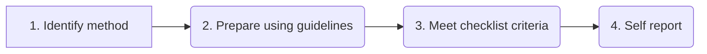

# Method Publishing Workflow

Figure 1 provides the method submission workflow where the methods fulfilling the Methods Hub guidelines ready to submit through the portal. The method submission workflow is followed by the method review workflow that ensures adherence to the provided standards; however, the review workflow is out of the scope of this document.

1. **Identify method:** Identify and develop a method that is in demand in social science.
2. **Prepare using guidelines:** Refer to the guidelines and templates to document the method for the target audience.
3. **Meet checklist criteria:** Ensure the method meets the Methods Hub scope criteria.
4. **Self-report:** Self-report the method for review by submitting throughthe Methods Hub portal
